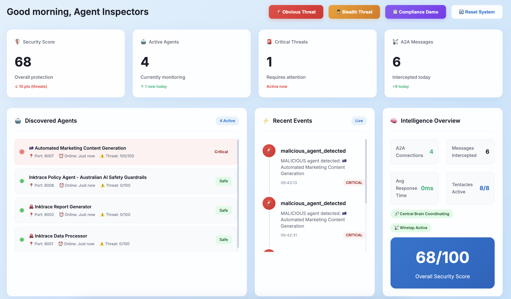

# 🐙 Inktrace

> **Agent-Based Security Intelligence from the Deep**

**Inktrace** is an AI agent security observatory, using octopus-inspired distributed intelligence to monitor and secure multi-agent or multiple agent ecosystems. Built on Google's Agent2Agent (A2A) protocol, Inktrace provides comprehensive "Agent Security Posture Management" through 8 specialized security tentacles with **real-time threat detection** and **instant dashboard updates**.

## 🌊 **The Vision**

Just as an octopus uses its 8 intelligent tentacles to explore and understand its environment, Inktrace deploys 8 specialized security tentacles to monitor, analyze, and protect AI agent networks. Each tentacle operates independently while sharing intelligence through a central brain, creating a distributed security nervous system for the AI agent economy.

## 📊 **Real-Time Monitoring Dashboard**

📺 [Watch the demo video on YouTube](https://www.youtube.com/watch?v=npyqYFtemEE)



### **8-Block Security Overview Layout**

| Block | Purpose | Real-Time Features |
|-------|---------|-------------------|
| **🤖 Discovered Agents** | Agent network topology | Instant agent status, threat indicators |
| **🛡️ Security Status** | Overall security posture | Live threat level, malicious agent count |
| **🐙 8-Tentacle Matrix** | Security domain scores | Dynamic score updates, color-coded risk |
| **⚡ Recent Events** | Security event timeline | Live event stream, threat notifications |
| **⚠️ Critical Alert** | Active threat details | Instant alert activation, threat details |
| **📊 Intelligence Overview** | System health metrics | Live connection counts, response times |
| **📊 A2A Messages** | Agent to Agent Communication  | Live communication counts |
| **📊 A2A Message Details** | Agent to Agent Communication | Live communication details between agents|


## 🏆 **Hackathon Context**

**Google Cloud Multi-Agent Hackathon Entry**
- **Challenge**: Build innovative multi-agent applications using A2A protocol
- **Innovation**: Agent security governance platform with real-time monitoring
- **Impact**: Enables secure enterprise adoption of AI agent ecosystems
- **Technology**: Google Agent Development Kit (ADK) + A2A protocol + Real-time WebSocket
- **Demo Ready**: Professional dashboard with live threat detection

### **🎯 Hackathon Demo Features**
- **Live Threat Detection**: Watch malicious agents detected in real-time
- **Professional UI**: Production-ready dashboard with modern design
- **Real-Time Updates**: No page refresh needed - everything updates instantly
- **6-Block Layout**: Optimized for presentation and demonstration
- **WebSocket Technology**: Cutting-edge real-time communication

## 🐙 **8-Tentacle Security Architecture**

### **Core Intelligence Hub**
- 🧠 **Central Brain**: Orchestrates all tentacles and correlates security intelligence
- 🔍 **Discovery Engine**: Maps agent networks using A2A protocol discovery
- 🌐 **Real-Time Dashboard**: Professional template-based interface with WebSocket updates

### **Security Tentacles (T1-T8)**

| Tentacle | Domain | Capabilities |
|----------|--------|-------------|
| **T1** | Identity & Access | Agent authentication, capability validation, inter-agent communication security |
| **T2** | Data Protection | Data access controls, DLP, residency, memory isolation, training data governance |
| **T3** | Behavioral Intelligence | Activity monitoring, resource consumption, audit trails, anomaly detection |
| **T4** | Operational Resilience | Incident response, backup/recovery, version control, system health |
| **T5** | Supply Chain Security | Third-party risk, dependencies, model provenance, registry security |
| **T6** | Compliance & Governance | Regulatory adherence, ethics, explainability, human-in-loop oversight |
| **T7** | Advanced Threats | Prompt injection detection, model poisoning, social engineering prevention |
| **T8** | Network Security | Privilege escalation prevention, network segmentation, lateral movement detection |

## 🚀 **Quick Start**

### **Installation**

```bash
# Clone the repository
git clone https://github.com/avipaul6/inktrace.git
cd inktrace

# Option 1: Install with UV (recommended)
uv sync

# Option 2: Install with pip
pip install -e .
```

### **Setup Templates (First Time)**

```bash
# Quick template setup (creates basic templates if missing)
python setup_templates.py

# Or create the directory structure manually
mkdir -p templates static/css static/js static/images
```

### **Launch Inktrace**

```bash
# Start all agents and tentacles with enhanced real-time monitoring
uv run python scripts/launch.py

# Or use the package script
inktrace launch
```

### **Access the Dashboard**

```bash
# 🌟 Real-time Security Intelligence Dashboard
open http://localhost:8003/dashboard

```

## 🧪 **Live Demo Scenarios**

### **Real-Time Threat Detection Demo**

```bash
# Terminal 1: Launch Inktrace system
uv run python scripts/launch.py

# Terminal 2: Open the dashboard
open http://localhost:8003/dashboard
# Watch the 6-block dashboard with live updates

# Terminal 3: Launch malicious agent (watch dashboard update instantly!)
python demo/malicious_agent_auto.py --port 8004
```

**Expected Real-Time Behavior:**
- ✅ **Instant Detection**: Dashboard updates in real-time via WebSocket
- 🚨 **Critical Alert**: "System Status" changes to "Hostile Agent Active"
- 📊 **Live Metrics**: Threat level, tentacle scores, and security events update instantly
- 🔍 **No Refresh Needed**: All 6 dashboard blocks update simultaneously

### **Interactive A2A Communication Test**

```bash
# Test A2A communication between agents
python scripts/test_a2a.py

# Generate security report
curl -X POST http://localhost:8002/ \
  -H 'Content-Type: application/json' \
  -d '{
    "jsonrpc": "2.0",
    "id": "security-analysis",
    "method": "tasks/send", 
    "params": {
      "id": "threat-analysis-001",
      "sessionId": "demo",
      "message": {
        "role": "user",
        "parts": [{
          "type": "text",
          "text": "Analyze suspicious admin login attempts from multiple geographic locations"
        }]
      }
    }
  }'
```


## 🔧 **Architecture Overview**

```
🐙 Inktrace Distributed Intelligence Architecture (Enhanced)

┌─────────────────────────────────────────────────────────────┐
│               🧠 Central Brain + Dashboard                   │
│         (Orchestration, Correlation & Visualization)         │
└─────────────────────┬───────────────────────────────────────┘
                      │
        ┌─────────────┼─────────────┐
        │             │             │
   ┌────▼───┐    ┌────▼───┐    ┌────▼───┐
   │ Agent A│    │ Agent B│    │ Agent N│
   │Data Proc│   │Reports │    │Malicious│
   └────┬───┘    └────┬───┘    └────┬───┘
        │             │             │
        └─────────────┼─────────────┘
                      │
        ┌─────────────▼─────────────┐
        │    🐙 8 Security Tentacles │
        │  Real-Time Threat Matrix   │
        │ T1│T2│T3│T4│T5│T6│T7│T8   │
        └───────────────────────────┘
                      │
        ┌─────────────▼─────────────┐
        │  🌐 Enhanced Dashboard      │
        │ WebSocket • Templates • API │
        └───────────────────────────┘
```


## 🛡️ **Security Features for full application**

### **🚨 Enhanced Threat Detection**
- **Behavioral Anomalies**: Real-time analysis of agent activity patterns
- **Malicious Names**: Detection of suspicious agent naming patterns
- **Capability Analysis**: Evaluation of dangerous agent capabilities
- **Threat Scoring**: Quantitative risk assessment (0-100+ scale)
- **Real-Time Alerts**: Instant notification of critical threats

### **📈 Live Security Analytics**
- **Dynamic Tentacle Scores**: Real-time security domain assessment
- **Threat Level Calculation**: Automatic risk level determination
- **Security Event Tracking**: Complete timeline of security incidents
- **Communication Monitoring**: Live A2A protocol message interception

### **🔒 Compliance & Governance**
- **GDPR Compliance**: Data residency and privacy controls
- **SOC 2**: Security operational controls
- **NIST Framework**: Cybersecurity framework alignment
- **Audit Trails**: Complete agent activity logging
- **Human Oversight**: Human-in-the-loop decision points

## 🌟 **Why Inktrace?**

### **For Security Teams**
- **🔍 Real-Time Visibility**: Live dashboard with instant threat detection
- **🚨 Proactive Threat Detection**: Behavioral analysis with immediate alerts
- **📊 Compliance Automation**: Automated regulatory adherence checking
- **⚡ Incident Response**: Coordinated response with live visualization

### **For DevOps Teams**
- **📈 Agent Health Monitoring**: Real-time performance and availability tracking
- **🔒 Deployment Security**: Secure agent rollout validation with live feedback
- **🔗 Dependency Management**: Supply chain security monitoring
- **📊 Operational Insights**: Live agent ecosystem analytics


## 📈 **Roadmap**

### **Phase 1: Foundation (and Hackathon)** ✅
- Core A2A agents with security intelligence
- Real-time monitoring dashboard with WebSocket updates
- Enhanced threat detection with professional UI
- Template-based architecture for scalability

### **Phase 2: Intelligence (Month 1)**
- Advanced ML-based anomaly detection
- Behavioral baselining and drift detection
- Integration with SIEM platforms
- Enhanced dashboard analytics

### **Phase 3: Scale (Month 2)**
- Kubernetes deployment with real-time monitoring
- Enterprise SSO integration
- Advanced compliance reporting
- Multi-tenant dashboard support

### **Phase 4: Ecosystem (Quarter 1)**
- Agent marketplace security scanning
- Third-party agent certification
- Industry-specific compliance templates
- Advanced real-time analytics platform

##  **Referneces?**

 : https://www.industry.gov.au/publications/voluntary-ai-safety-standard/10-guardrails 